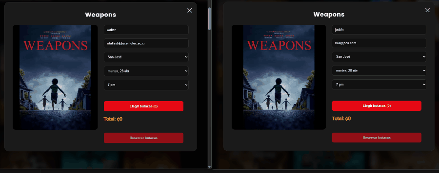
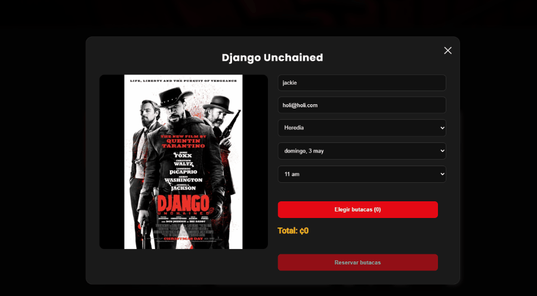
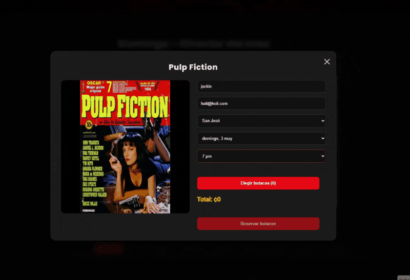

# 🎬 Cinema Classic React

A **real-time cinema booking system** built with React and Firebase.
This project simulates a production-level movie ticket platform, featuring **concurrent seat reservation, live updates, and QR-based ticket validation**.

---

## 🚀 Live Demo

👉 https://cinema-classic-react.vercel.app/

**Try it yourself:**

* Open the app in two tabs and select the same seats → see real-time blocking
* Reserve seats and wait 5 minutes → they automatically expire
* Buy a ticket → check it in **My Tickets** with QR code

---

## 🧩 Core Features

### 🔥 Real-Time Seat Reservation

* Live seat availability using Firebase Firestore
* Temporary seat locking system (5-minute expiration)
* Conflict prevention using **transactions**
* Multi-user safe booking (no double booking)

---

### 🎟 Ticketing System

* QR code generated for each ticket
* Tickets stored per user in Firestore
* “My Tickets” dashboard
* Automatic classification:

  * **Upcoming**
  * **Starting Soon** (≤ 30 minutes)
  * **Past / History**

---

### ⏳ Smart Time Handling

* Real-time countdown timer for reservations
* Automatic seat release on expiration
* Disabled past showtimes
* Accurate time-based UI logic (date + time combined)

---

### 🎨 Modern UI / UX

* Dark cinema-style theme
* Responsive layout
* Seat selection modal
* Visual feedback for reservation states
* “Starting Soon” badge for imminent showtimes

---

## 🧠 Technical Challenges Solved

### ⚡ Concurrency Control

Handled multiple users attempting to reserve the same seats using **Firestore transactions**, ensuring data consistency and preventing race conditions.

---

### ⏳ Reservation Expiration System

Implemented a timed reservation mechanism:

* Seats are locked for 5 minutes
* Automatically released if not purchased
* Prevents stale reservations and improves availability

---

### 🔄 Real-Time Synchronization

Used Firestore `onSnapshot` listeners to:

* Sync seat availability across users
* Update countdown timers in real time
* Reflect live reservation changes instantly

---

### 🧮 Time-Based Ticket Logic

Solved edge cases for same-day bookings:

* Combined **date + showtime** instead of just date
* Ensured correct classification (upcoming vs past)
* Added “Starting Soon” detection (≤ 30 min)

---

## 🛠 Tech Stack

* **Frontend:** React
* **Backend / DB:** Firebase Firestore (real-time)
* **Authentication:** Firebase Auth
* **QR Generation:** qrcode library
* **Routing:** React Router
* **Styling:** Custom CSS (dark theme)
* * **Hosting:** Vercel

---

## 📸 Screenshots

## ⚡ Real-Time Seat Locking

> Seats update instantly across multiple users using Firestore real-time listeners.




## ⏳ Reservation Expiration System

> Seats are temporarily locked and automatically released if not purchased.




## 🎟 Complete Booking Experience

> From seat selection to QR-based ticket validation.



---

## 🚧 Future Improvements

* 👀 Live seat activity (see other users selecting seats in real time)
* 💳 Payment integration (Stripe)
* 🔔 Notifications for upcoming movies
* ⚡ Performance optimizations (lazy loading, code splitting)
* 🎬 Enhanced animations and micro-interactions

---

## 💡 What This Project Demonstrates

* Real-time systems with Firebase
* Handling concurrency in frontend applications
* UX design for interactive booking flows
* State management across complex user flows
* Building production-like features without a backend server

---

## ⚙️ Installation

```bash
git clone https://github.com/walterfcr/CinemaClassic-React.git
cd CinemaClassic-React
npm install
npm run dev
```


=======
🔑 Environment Variables

Create a .env file in the root of the project and add your Firebase configuration:

VITE_FIREBASE_API_KEY=...
VITE_FIREBASE_AUTH_DOMAIN=...
VITE_FIREBASE_PROJECT_ID=...
VITE_FIREBASE_STORAGE_BUCKET=...
VITE_FIREBASE_MESSAGING_SENDER_ID=...
VITE_FIREBASE_APP_ID=...


## 👨‍💻 Author

**Walter Fallas**
🌐 https://walterfallascr.com/
💻 https://github.com/walterfcr

---

## ⭐ Final Note

This project goes beyond a basic CRUD app — it focuses on **real-world challenges like concurrency, timing, and user experience**, making it a strong foundation for scalable applications.


## 📄 License

This project is for educational and portfolio purposes.


